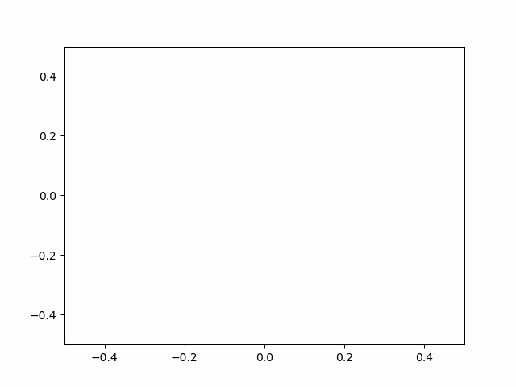

# 2022 - NRI

Reimplementation of the Neural Relation Inference proposed in the following paper: Kipf, Thomas, et al. "Neural relational inference for interacting systems." *International Conference on Machine Learning*. PMLR, 2018.

## Prerequisites

Recommend using conda virtual environment. A `environment.yml` file has been set up. Simply run the following command to setup the required environment.

```
conda env create --name recoveredenv --file environment.yml
```

Next, create a local package (named `src`). Notice that `-e` indicates that the package is editable (no need to reinstall ) and `.` indicates the current folder. This approach takes the advantage of python package system. 

```
pip install -e.
```

## Model training and testing

Run the following code to train the encoder and the decoder respectively. 
When the best model (selected through validation) is obtained, test the model.

```
/scripts$ python train_enc.py
/scripts$ python train_dec.py
```

You can further adjust training arguments. For details, use `python train_enc.py  -h`.

Notice that GPU is not necessary for training. You can train the model in a short time on a CPU platform. 

## Run demo

We provide `run_decoder.py` and `run_encoder.py` for trajectory generation based on trained model. 
Simply run `python run_decoder.py` and a gif will show up in the root directory.

The visualization part of `run_encoder.py` is still under development. 

<table><tr>
<td>  </td>
<td>  </td>
</tr></table>

## TODOs


